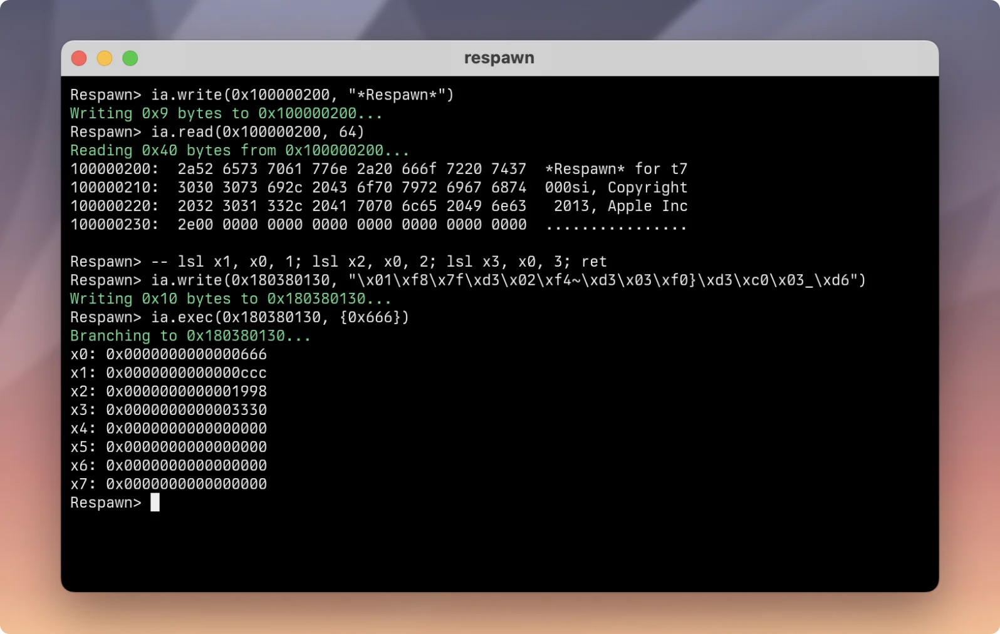

# Respawn



Respawn is an experimental research tool for iPhone models vulnerable to the
infamous [checkm8](https://theapplewiki.com/wiki/Checkm8_Exploit)
vulnerability. It is a completely-rewritten version of an older project,
[Pawn](https://twitter.com/jonpalmisc/status/1596177346616512512). The name is
a portmanteau of "resurrected Pawn".

## Motivation

While the project is mostly just for fun and nostalgia now, the original
purpose was to create a high-quality checkm8 exploit implementation and
subsequent environment for iPhone security research.

Respawn's code is aims to be modern, pragmatic, and easy to read. Numerous
design decisions, bits of lore, etc. are documented inside.

## Building

Respawn uses CMake as its build system, and has a few small dependencies that are
already included as submodules. Start by performing a recursive clone of
Respawn and all of its submodules:

```sh
git clone --recurse-submodules git@github.com:jonpalmisc/respawn.git
```

Next, once inside the cloned repo, configure the project with CMake:

```sh
cmake -S . -B build # -GNinja ...
```
> If you get errors about missing `CMakeLists.txt` files, you likely forgot to
> clone recursively (or otherwise initialize all submodules) as shown above.

Finally, simply build the project with CMake:

```sh
cmake --build build
```

> At this point, if you are not on macOS you will notice you are missing some
> headers. Respawn uses [Sioku](https://github.com/jonpalmisc/sioku) for all of
> its USB operations, which is based on IOKit. Sorry...

A `respawn` executable will be available at `./build/respawn` upon completion.

## Usage

Once built, first run `respawn -h` to see a full list of options; the built-in
help will always have the most up-to-date usage instructions and options.

By default, Respawn doesn't emit much output. If something isn't working or if
you desire more detail, the `-v` flag can be passed to Respawn to enable
verbose logging.

### REPL

Most likely, you will want to use Respawn's REPL interface to poke around on
the device. Running `respawn -r` will launch the REPL, exploiting the device
first if it has not been already.

To get started, try reading SecureROM's build banner string:

```
> ia.read(0x100000200, 64)
100000200:  5365 6375 7265 524f 4d20 666f 7220 7437  SecureROM for t7
100000210:  3030 3073 692c 2043 6f70 7972 6967 6874  000si, Copyright
100000220:  2032 3031 332c 2041 7070 6c65 2049 6e63   2013, Apple Inc
100000230:  2e00 0000 0000 0000 0000 0000 0000 0000  ................
```
> The `interactive` module is aliased to `ia` in the REPL for convenience.

Respawn's REPL is really just a [Lua](https://www.lua.org/) REPL with some
native functions exposed. You can evaluate arbitrary Lua code, automate device
actions by loading Lua scripts, etc.

> Respawn expects to find its built-in Lua modules in the `lua` folder of the
> current working directory. The invocation above should actually be
> `./build/respawn` if you followed the build instructions above and are in the
> project's root directory; alternatively you can copy the executable out of
> the build folder to the root directory.

To get more familiar with using the REPL to interact with the device, take a
look at [`test.lua`](lua/test.lua), which checks that all of the features
provided by the `device` module are working as expected. If you aren't writing
scripts, you will probably want to use the equivalent functions in the
`interactive` module to get better feedback. 

### Known Limitations

- Only devices with T7000 or S8000 SoCs are supported.
- Initial exploitation time varies considerably based on unknown factors.
- Only one device can be connected at once.
- Respawn only builds and runs on macOS since it depends on IOKit.

#### T8015 support

Being one of the most recent SoCs still vulnerable to checkm8, support for
T8015 devices is desirable and is a glaring omission right now. Respawn's
predecessor Pawn (which remains closed-source) had mostly-complete support for
T8015 devices, but via a rather messy implementation that would require
rewriting to integrate back into this project.

Given that checkm8 is largely dead now in 2023, T8015 support may never arrive;
but maybe with enough rainy days it will.

## Credits

Acknowledgements are due to a handful of individuals that othewise don't appear
in the Git history:

- Parts of Respawn's predecessor Pawn were contributed by
  [@0cyn](https://github.com/0cyn).
- An old version of [@0x7ff](https://github.com/0x7ff)'s
  [gaster](https://github.com/0x7ff/gaster) was used as a reference during the
  early stages of Pawn's development back in 2022.
- Like many other checkm8 proejcts, some of the exploit primitives
  (`ExploitDriver::do_*` in Respawn's case) are lifted from
  [ipwndfu](https://github.com/axi0mX/ipwndfu) by
  [@axi0mX](https://twitter.com/axi0mx).

Furthermore, this project would have been a lot less fun and a lot more
annoying without the knowledge and moral support contributed by the artist
formerly known as @bendycatus, [@Siguza](https://siguza.net/), and other
friends I'm probably forgetting along the way.

## License

Copyright &copy; 2022&ndash;2023 Jon Palmisciano. All rights reserved.

Use of Respawn and its source code is governed by the BSD 3-Clause license; the
full terms of the license can be found in [LICENSE.txt](LICENSE.txt).
